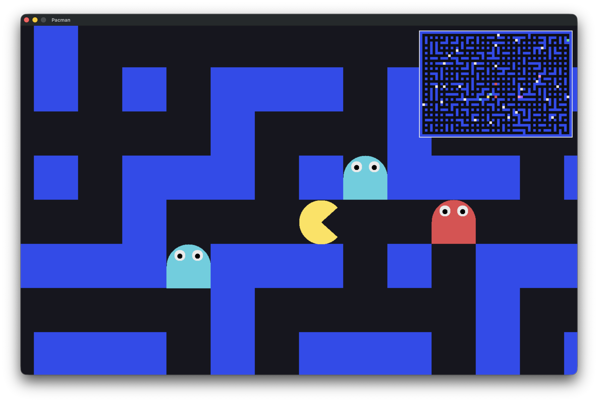

# Pacman



<!-- Gameplay clip: drag assets/video.mov into a GitHub issue or comment to upload it (under 10MB),
     then paste the github.com/.../assets/... URL it gives you on its own line right here to embed a player. -->

A Pacman game written in C with SDL2. You move through a maze collecting every dot (`C`); the exit (`E`)
stays locked until you have collected them all. Ghosts hunt you down, and touching one ends the run.

The main view is a close-up that stays centered on the player. The mini-map in the top-right corner shows
the whole maze at once, with the live positions of you, the dots and the ghosts.

## How it works

- **Ghosts chase you with breadth-first search.** A BFS runs out from the player across the maze, and each
  ghost steps one cell along the shortest path toward you — they don't wander, they close in. The player
  moves faster than the ghosts, so the open, looping maze is what lets you shake them.
- **Maps are checked with depth-first search.** Before a level loads, a DFS verifies there is a route that
  collects every dot and then reaches the exit; an unsolvable map is rejected.
- **Maps are `.ber` files** — a rectangular, wall-bordered grid of `1` wall, `0` path, `P` player, `C` dot,
  `X` ghost, `E` exit. Six levels ship in `maps/`, each bigger and harder than the last (more dots, more
  ghosts).

## Build and run

```sh
make
./pacman                # level 1 (maps/001.ber)
./pacman maps/006.ber   # pick a level
```

Needs SDL2 (`brew install sdl2` on macOS). The window sizes itself to your screen.

## Controls

- Arrow keys — move
- Space — pause (movement freezes; the mouth and ghost eyes keep animating)
- Esc — quit
